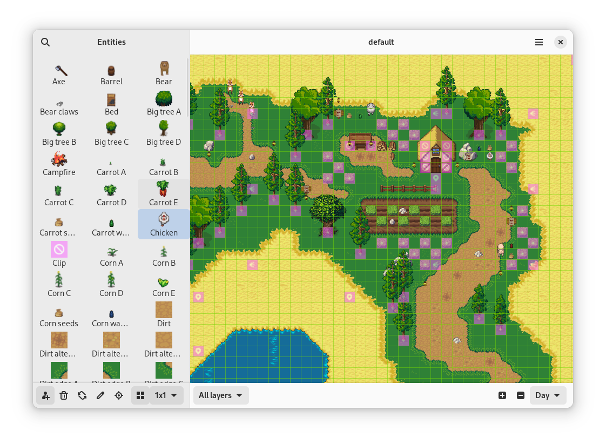

# Gameeky 

Play, create and learn.

Gameeky lets young learners and educators create and explore cooperative games and learning experiences.

More specifically:

* Play and explore games with friends
* Create new games without writing any code
* Tell stories through these games
* Nurture artistic skills by designing game objects and creatures
* Grasp the basics of programming using Python in a LOGO-like experience
* Mature programming skills by extending games with Python plugins

## Use it

Learn more about this project by reading the [beginner's guide](docs/basics/src/en/index.md).

## Contribute

Everyone is welcome to contribute to this project, please read these [instructions](CONTRIBUTING.md) carefully.

## Copyright

© 2024 [Martín Abente Lahaye](https://tchx84.dev)

## Disclaimer

This program is free software: you can redistribute it and/or modify it under the terms of the GNU General Public License as published by the Free Software Foundation, either version 3 of the License, or (at your option) any later version.

This program is distributed in the hope that it will be useful, but WITHOUT ANY WARRANTY; without even the implied warranty of MERCHANTABILITY or FITNESS FOR A PARTICULAR PURPOSE. See the [GNU General Public License](COPYING) for more details.
