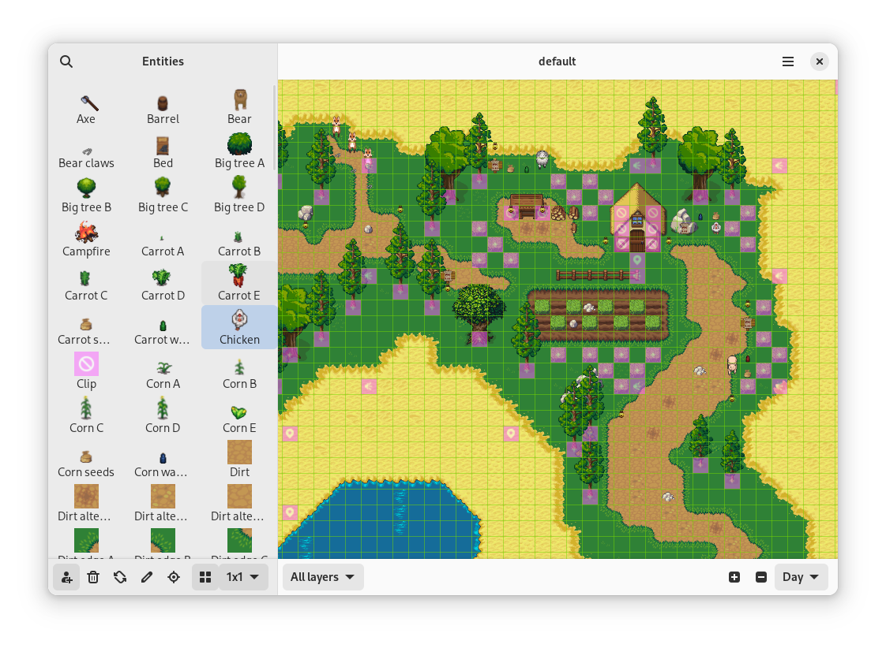
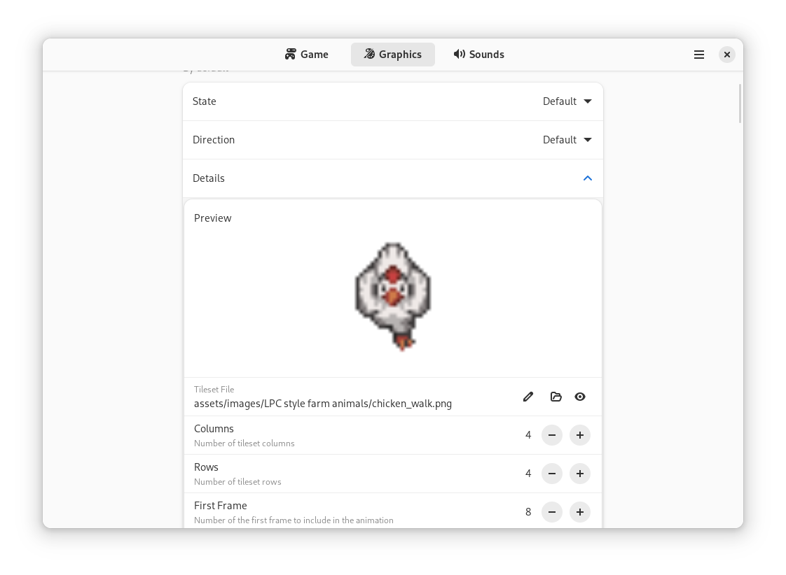

# Welcome to the Gameeky documentation

> [!WARNING]
> This is early software and subject to change.

## Topics

1. [Introduction](#introduction)
2. [Installation](#installation)
3. [Thematic packs](#thematic-packs)
4. [Overview](#overview)
5. [The Launcher](#the-launcher)
6. [The Player](#the-player)
7. [Cooperative game play](#cooperative-game-play)
8. [The Scene Editor](#the-scene-editor)
9. [The Entity Editor](#the-entity-editor)
10. [LOGO-like code](#logo-like-code)
11. [Plugins](#plugins)

## Introduction

[Gameeky](https://github.com/tchx84/gameeky) lets young learners and educators create and explore cooperative games and learning experiences. More specifically:

* Play and explore games with friends.
* Create new games without writing any code.
* Tell stories through these games.
* Nurture artistic skills by designing game objects and creatures.
* Grasp the basics of programming using Python in a LOGO-like experience.
* Mature programming skills by extending games with Python plugins.

> [!NOTE]
> This is a learning tool in the shape of a game engine. It's not a professional game engine. If you're looking for a tool to create professional video games, please consider the [Godot](https://godotengine.org) game engine.

## Installation

The recommended installation method is through your system's software center, e.g. *GNOME Software*. Simply search for *Gameeky* and install it. Alternatively, it can also be installed through [Flathub](https://flathub.org). Similarly, just search for *Gameeky* and follow the website's instructions.

Lastly, it can also be installed via terminal:

```bash
flatpak --user install flathub dev.tchx84.Gameeky
```

## Thematic packs

Gameeky provides predefined packs of projects and building blocks for different interests, e.g. A farming role [game](https://github.com/tchx84/FreedomValley) in a medieval fantasy setting. A thematic pack can contain:

* **Assets** like tilesets, sprites and sounds.
* **Entities** with predefined properties and behaviors.
* **Scenes** created with those Entities.
* **Actuators** that extend Gameeky's predefined behaviors.

The recommended installation method is through your system's software center, e.g. *GNOME Software*. Thematic packs are offered as addons from the Gameeky page. Simply select and install the addon. Alternatively, it can also be installed through [Flathub](https://flathub.org). Similarly, thematic packs are offered as addons from the Gameeky page. Simply select and install the addon.

Lastly, packs can also be installed via terminal:

```bash
flatpak --user remote-ls flathub | grep dev.tchx84.Gameeky.ThematicPack
flatpak --user install flathub dev.tchx84.Gameeky.ThematicPack.FreedomValley
```

## Overview

Gameeky is made of four main components:

1. The **Launcher** is the main component where all thematic packs and projects can be found and launched from.
2. The **Player** is where games are played and joined.
3. The **Scene Editor** is where Scenes can be created and edited.
4. The **Entity Editor** is where Entities can be created and edited.

## The Launcher

The launcher provides an easier way to manage thematic packs installed as addons and projects located under the `~/gameeky` directory. It provides all basic operations for:

* Creating a new project.
* Editing an existing project.
* Removing an existing project.


## The Player

Starting a new game is easy as clicking on the project's *Play* button from the Launcher but, to play another Scene within the same project follow these steps:

1. From the Launcher, click *Play* button on the project's card.
2. From the Player, go to the menu and select on *New* option.
3. From the creation dialog, select the Scene file and click on the *Create* button.


### In-game HUD

The in-game [HUD](https://en.wikipedia.org/wiki/HUD_(video_games)) is minimal as it only provides the following:

* A green bar that represents the player's Entity durability, e.g. To convey the health of the player's Entity.
* A blue bar that represents the player's Entity stamina, e.g. To convey how many actions can still be performed by the player's Entity.
* An icon slot that represents the Entity that is currently being held by the player's Entity.

### Controls

Once in the game the player's Entity can be controlled in two ways:

* **Keyboard** controls. Go to the menu and select the *Keyboard Shortcuts* option to see the full list of key bindings.
* **Mouse** controls. Right-click on the game canvas and select actions from the popover. To move the Entity just click any spot of the Scene.

### Actions

The player's Entity can perform the following actions:

* **Move** to advance in one of four directions, e.g. To move the player's Entity to the *North*.
* **Take** to hold another Entity that's directly in front of the player's Entity, e.g. To move that Entity.
* **Use** to apply any effects that the held Entity might have. These effects affect the Entities that are located right in font of the player's Entity, e.g. Use an axe Entity to cut down some log Entities.
* **Drop** to stop holding an Entity, e.g. To stop moving that Entity.
* **Interact** to activate any behavior from the Entities that are located right in front of the player's Entity, e.g. To activate a teleport Entity or read the dialogue from a sign Entity.
* **Stop** to stop any action being performed and simply idle.

### Save files

The state of the game can be saved at any moment and restored later. Save files are full copies of the Scene and therefore proper Scene files.

1. To save the state of the game go to the menu and select the *Save As* option.
2. To restore the state of the game follow the same steps described above for opening another Scene.

## Cooperative game play

Starting a new game is easy as clicking on the *Play* button on the project's card from the Launcher but, to start a cooperative game these steps must be followed:

1. From the Launcher, click on the *Play* button on the project's card.
2. From the Player, go to the menu and select the *New* option.
3. From the creation dialog, increased the number of players and then click on the *Create* button.

To join a cooperative game:

1. From the Launcher, click on the *Play* button on the same project's card.
2. From the Player, go to the menu and select the *Join* option.
3. From the joining dialog, specify the [IP address](https://flathub.org/apps/org.gabmus.whatip) of whoever started the cooperative game and click on the *Join* button.

## The Scene Editor

Editing an existing Scene is easy as clicking on the *Edit* button on the project's card but, to create a new Scene it's recommended to start off an existing project such as a thematic pack. So, follow these steps to add a new Scene:

1. From the Launcher, click on the *Copy* button on the project's card. This step is **only** needed for thematic packs. Thematic packs can't be modified, so this creates an editable copy.
2. From the Launcher, click on the *Edit* button on the project's card.
3. From the Scene Editor, go to the menu and select the *New* option.



### Concepts

A Scene is simply a collection of Entities arranged in a tiles matrix. The basic properties of a Scene are:

* A **name** that must be unique among the Scenes of the same project.
* The **time** of the day in which the scene occurs. It can be *Day*, *Night* or *Dynamic*.
* if *Dynamic*, the **duration** specifies the seconds of a full day and night cycle. Otherwise this property ignored.
* The **width** of the scene specifies the total number of tiles on the horizontal axis.
* The **height** of the scene specifies the total number of tiles on the vertical axis.

### Workflow

The Scene editing workflow resembles one of a painting tool. Entities are painted and removed to and from the Scene. The basic steps are the following:

1. To **add** Entities to the Scene, select an Entity from the left panel and place it on the Scene by clicking on a tile in the matrix.
2. To **remove** Entities from the scene, select the *Remove* tool from the left panel and remove an Entity from the Scene by clicking on the tile in the matrix.
3. Although Entities come with predefined properties and behaviors, particular Entities in the Scene can be **customized** by selecting the *Edit* tool from the left panel and then clicking on the tile in the matrix.

Additionally, the Scene Editor provides helpers to make things easier such as:

* Drawing area selector to add or remove multiple Entities at once.
* Layer selector to modify Entities at a specific layer.
* Time selector to visualize the Scene at *Day* or *Night*.

### Tips and tricks

For an improved experience, try the following tips and tricks:

* When creating the basic terrain of the Scene, use the Layer selector and set it at *Layer 0*. This will reduce the unnecessary overlapping of terrain tiles and ease the editing workflow overall.
* When editing an Scene, leave the Player open on that Scene. When changes are saved to the Scene, the Player will detect these changes and presents an option to reload the Scene. This reduces the time switching between the Scene Editor and the Player.
* When editing an Scene, use the initial location setter tool from the left panel to place the player's Entity in a more convenient location to inspect the changes.

## The Entity Editor

Before creating a new Entity from scratch, it's recommended to inspect existing Entities from thematic packs. So, to inspect an existing Entity follow these steps:

1. From the Scene Editor, right-click on an Entity in the left panel.
2. Select the *Edit* option from the popover.

To create a new Entity, follow these steps:

1. From the Scene Editor, right-click anywhere in the left panel.
2. Select the *Add* option from the popover.



### Concepts

Entities represent everything that can exist in the game, e.g. The grass, the player, a light source, the background music and even the game logic. An Entity is composed of three parts:

1. **Game** logic properties.
2. **Graphics**.
3. **Sounds**.

#### Game logic properties

These properties determine how Entities behave and interact with other Entities, e.g. Different combinations of these properties will determine whether an Entity is acting as a static stone or a living foe.

Although there two dozen properties, a few of these require special attention here:

* The **identifier** must be unique among all the Entities of the same project.
* An Entity is always in one and a single **state**, e.g. *Idling*, *Moving*, *Destroyed*, etc. The state can change by performing different actions, by intrinsic or extrinsic means.
* An Entity is always pointing to one and a single **direction**. It can be *North*, *East*, *South* or *West*.
* An Entity state can be changed intrinsically by **actuators** that provide predefined logic to Entities, e.g. A **Roams** actuator will move the Entity in random directions, and a **Destroys** actuator will flag the Entity for removal from the Scene when its durability reaches zero.
* All Entity properties coexist in a single system and therefore some behaviors can emerge from different combinations of these properties, e.g. The speed in which an Entity can move it's determined by its **weight** and its **strength**, while the total weight of an Entity depends on the weight of the Entity its holding, and so on.

#### Graphics

Entities are represented on screen through 2D graphics, which can be static or animated.

These graphics are assigned to specific combinations of state and direction, e.g. An specific animation will be rendered when an Entity is *Moving* to the *West*, while another animation will be rendered when the same Entity is *Idling* to the *South*.

All Entities **must** provide a *Default* graphic, e.g. To visualize it on the Scene Editor.

#### Sounds

Similarly to graphics, Entities can emit sounds when in specific states, e.g. Footsteps sound is played when the Entity is *Moving*. Only states are taken into account, the Entity direction takes no part in sounds.

There aren't *Default* sounds, as sounds are optional.

### Workflow

The Entity creation workflow is similar to filling a form or a template. The most basic Entity is created with the following steps:

1. Under the *Game* tab, start setting the values from top to bottom. Note that all properties provide their own defaults. Only the identifier is mandatory. Setting a name is recommended so that it's easier to find the Entity on the Scene Editor.
2. Under the *Graphics* tab, click on the *Add* button to add the first and default animation. Leave both *State* and *Direction* to *Default*. Expand the *Details* section of the default animation to select an image. Click on the *View* button to inspect the selected image.
3. Save the Entity and use it from the Scene Editor.

### Tips and Tricks

For an improved experience, try the following tips and tricks:

* When creating a new thematic pack assume that the Entity with identifier number *1* will be assigned to players in game.
* When creating a new Entity, always begin with setting the identifier number and then *Save* the Entity to disk. Keep the name suggested by the Entity Editor. This will make it easier to assign these identifiers along the road.
* When creating a new animation, always leave both the Entity Editor and the Entity Editor's image viewer open, side by side. This will make it easier to setup the animation frames.

## LOGO-like code

Having support for cooperative game play opens the door for cooperators that can be controlled with code. To achieve this, Gameeky provides a small library that enables learners to control a single Entity using Python, in a LOGO-like experience.

### Workflow

Follow these steps to start a cooperative game:

1. From the Launcher, click on the *Play* button on the project's card.
2. From the Player, go to the menu and select the *New* option.
3. From the creation dialog, increased the number of players and then click on the *Create* button.

To join the game from code these steps must be followed:

1. Write Python code that uses Gameeky's library, see examples below.
2. Run that code from the terminal with the following command:

```bash
cd ~/path/to/my/file/
flatpak --user run --filesystem=$PWD --command=dev.tchx84.Gameeky.Exec dev.tchx84.Gameeky sample.py
```

### Examples

Join and leave a [game](../../../src/gameeky/library/game.py):

```python
from gameeky.library import Game

game = Game(project="~/gameeky/project", address="127.0.0.1")
game.join()
game.quit()
```

Perform [actions](../../../src/gameeky/common/definitions.py):

```python
from gameeky.library import Game
from gameeky.common.definitions import Direction

game = Game(project="~/gameeky/project", address="127.0.0.1")
game.join()

game.idle(time=1000)
game.move(Direction.EAST, time=1000)
game.move(Direction.WEST, time=1000)
game.take(time=1000)
game.use(time=1000)
game.drop(time=1000)
game.interact(time=1000)

game.quit()
```

Inspect the position and basic properties of the player's [Entity](../../../src/gameeky/common/entity.py):

```python
from gameeky.library import Game

game = Game(project="~/gameeky/project", address="127.0.0.1")
game.join()

game.update()
print(game.entity.position.x, game.entity.position.y)

game.quit()
```

Inspect the state of the [Scene](../../../src/gameeky/common/scene.py):

```python
from gameeky.library import Game

game = Game(project="~/gameeky/project", address="127.0.0.1")
game.join()

game.update()
for entity in game.scene.entities:
    print(entity.position.x, entity.position.y)

game.quit()
```

> [!NOTE]
> Cooperators can only see their immediate surroundings of the Scene, not the full Scene.


Inspect the player's Entity advance [stats](../../../src/gameeky/common/stats.py):

```python
from gameeky.library import Game

game = Game(project="~/gameeky/project", address="127.0.0.1")
game.join()

game.update()
print(game.stats.durability, game.stats.stamina, game.stats.held)

game.quit()
```

## Plugins

Actuators can modify the behavior an Entity. A single Entity can use multiple Actuators to model more complex behaviors. Although there's a wide range of predefined Actuators, the end result is limited when compared to actual code. Therefore, Gameeky supports user-created Actuators to extend what the predefined Actuators can do.

### Concepts

There are three types of Actuators:

1. **Regular** Actuators enact on each tick of the Scene, e.g. [Moving](../../../src/gameeky/server/game/actuators/roams.py) the Entity in a random location.
2. **Activatable** Actuators enact only when activated in intervals or by another Actuator, e.g. [Spawning](../../../src/gameeky/server/game/actuators/spawns.py) a new foe Entity in the Scene every five seconds.
3. **Interactable** Actuators enact when another Entity interacts with their parent Entity, e.g. [Teleporting](../../../src/gameeky/server/game/actuators/teleports.py) an Entity to a different location when interacting with a door Entity.

All Actuators use their parent Entity game properties to modify their behavior:

* The *Target Name* and *Target Type* properties can be used to filter the Entities affected by the Actuator, e.g. [Targeting](../../../src/gameeky/server/game/actuators/aggroes.py) only certain Entities types for aggression.
* The *Rate* property can be used in activatables to reduce the activation frequency, e.g. [Transmuting](../../../src/gameeky/server/game/actuators/transmutes.py) an Entity into another Entity type after ten seconds.
* The *Radius* property can be used to determine the effect radius of an Actuator, e.g. [Burning](../../../src/gameeky/server/game/actuators/affects.py) an Entity when closing in a campfire Entity.

### Workflow

Follow these steps to create a new Actuator:

1. Open a new document in your preferred text editor.
2. Write your own Actuator class, see examples below.
3. Save the new document to `~/gameeky/YOUR_PROJECT_NAME/actuators/YOUR_ACTUATOR_NAME.py`
4. From the Entity Editor, go under the *Game* tab to the Actuators section.
5. A new option called *YOUR_ACTUATOR_NAME* will be displayed along with the predefined actuators.
6. Select it and save the Entity to disk.

> [!NOTE]
> User-created Actuators can also be accessed from the Scene Editor when customizing specific entities.

### Examples

The basic [Actuator](../../../src/gameeky/server/game/actuators/base.py) structure:

```python
from gameeky.plugins import Actuator as Plugin

class Actuator(Plugin):
    def tick(self) -> None:
        pass
```

Access the parent [Entity](../../../src/gameeky/server/game/entity.py):

```python
from gameeky.plugins import Actuator as Plugin

class Actuator(Plugin):
    def tick(self) -> None:
        print(self.entity.name)
```

Make the parent Entity perform an action:

```python
from gameeky.plugins import Actuator as Plugin
from gameeky.common.definitions import Action, Direction

class Actuator(Plugin):
    def tick(self) -> None:
        self.entity.perform(Action.MOVE, Direction.SOUTH)
```

Display a dialogue to the parent Entity:

```python
from gameeky.plugins import Actuator as Plugin

class Actuator(Plugin):
    def tick(self) -> None:
        self.entity.tell("Hello...")
```

Inspect what's in front of the parent Entity:

```python
from gameeky.plugins import Actuator as Plugin

class Actuator(Plugin):
    def tick(self) -> None:
        for entity in self.entity.obstacles:
            print(entity.name)
```

Inspect Entities sharing the same position as the parent Entity:

```python
from gameeky.plugins import Actuator as Plugin

class Actuator(Plugin):
    def tick(self) -> None:
        for entity in self.entity.surfaces:
            print(entity.name)
```

Inspect Entities that surround the parent Entity:

```python
from gameeky.plugins import Actuator as Plugin

class Actuator(Plugin):
    def tick(self) -> None:
        for entity in self.entity.surroundings:
            print(entity.name)
```

> [!NOTE]
> The *surroundings* method takes into account the *radius* property from the parent Entity.

Inspect all Entities in the [Scene](../../../src/gameeky/server/game/scene.py) that are not static:

```python
from gameeky.plugins import Actuator as Plugin

class Actuator(Plugin):
    def tick(self) -> None:
        for entity in self.entity.scene.mutables:
            print(entity.name)
```

Inspect all Entities that are controlled by players:

```python
from gameeky.plugins import Actuator as Plugin

class Actuator(Plugin):
    def tick(self) -> None:
        for entity in self.entity.scene.playables:
            print(entity.name)
```

Create an Actuator that enacts every five seconds:

```python
from gameeky.plugins import Actuator as Plugin

class Actuator(Plugin):
    activatable = True

    def tick(self) -> None:
        if not self.ready:
            return

        print("Activated...")

        super().tick()
```

> [!NOTE]
> The *ready* property takes into account the *rate* property from the parent Entity.

Create an Actuator that enacts only when interacted by a player:

```python
from gameeky.plugins import Actuator as Plugin

class Actuator(Plugin):
    interactable = True

    def prepare(self, interactee: "Entity") -> bool:
        if interactee.playable is False:
            return False

        return super().prepare(interactee)

    def tick(self) -> None:
        if self.interactee is None:
            return

        print(f"Interacted with {self._interactee.name}")

        super().tick()
```

Fore more complex examples check Gameeky's predefined [actuators](../../../src/gameeky/server/game/actuators/) directory.

### Tips and Tricks

For an improved experience, try the following tips and tricks:

* A single Actuator should not modify the whole Scene. Iterating over the whole Scene is extremely costly and the performance will be severed, e.g. Stick to *mutables* and *playables* only.
* It's preferred to write different actuators for different behaviors, e.g. Avoid writing a single Actuator that implements all of your custom behaviors. This will make it easier to understand in the long run.
* Use only public methods and attributes, e.g. Stick to methods like *obstacles* or *interactee*. This will make it less likely that your Actuators will break in the future.
