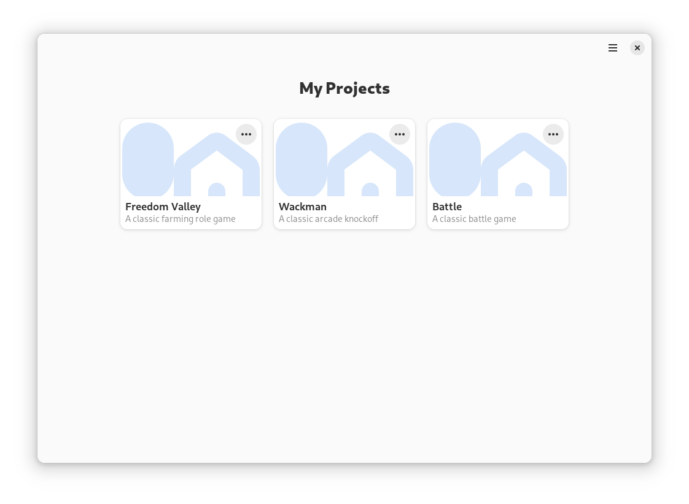

# Bienvenida a la documentación de Gameeky

> [!WARNING]
> Este es un software reciente y está sujeto a cambios.

## Temas

1. [Introducción](#introducción)
2. [Instalación](#instalación)
3. [Paquetes temáticos](#paquetes-temáticos)
4. [Descripción general](#descripción-general)
5. [El Lanzador](#el-lanzador)
6. [El Reproductor](#el-reproductor)
7. [Juego cooperativo](#juego-cooperativo)
8. [El Editor de Escenas](#el-editor-de-escenas)
9. [El Editor de Entidades](#el-editor-de-entidades)
10. [Código similar a LOGO](#código-similar-a-LOGO)
11. [Complementos](#complementos)

## Introducción

[Gameeky](https://github.com/tchx84/gameeky) permite a jóvenes estudiantes y educadores crear y explorar juegos cooperativos y experiencias de aprendizaje. Más específicamente:

* Juega y explora juegos con amigos.
* Crea nuevos juegos sin escribir ningún código.
* Cuenta historias a través de estos juegos.
* Fomentar habilidades artísticas diseñando objetos y criaturas del juego.
* Comprende los conceptos básicos de programación usando Python en una experiencia similar a la de LOGO.
* Habilidades de programación maduras ampliando juegos con complementos de Python.

> [!NOTE]
> Esta es una herramienta de aprendizaje en forma de motor de juego. No es un motor de juego profesional. Si está buscando una herramienta para crear videojuegos profesionales, considere el motor de juegos [Godot](https://godotengine.org).

## Instalación

El método de instalación recomendado es a través del centro de software de su sistema, p. *GNOME Software*. Simplemente busque *Gameeky* e instálelo. Alternativamente, también se puede instalar a través de [Flathub](https://flathub.org). Del mismo modo, simplemente busque *Gameeky* y siga las instrucciones del sitio web.

Por último, también se puede instalar mediante la terminal:

```bash
flatpak --user install flathub dev.tchx84.Gameeky
```

## Paquetes temáticos

Gameeky proporciona paquetes predefinidos de proyectos y bloques de construcción para diferentes intereses, ej. Un [juego](https://github.com/tchx84/FreedomValley) de rol en un entorno de fantasía medieval. Un paquete temático puede contener:

* **Recursos** como como sprites y sonidos.
* **Entidades** con propiedades y comportamientos predefinidos.
* **Escenas** creadas con esas Entidades.
* **Actuadores** que amplían los comportamientos predefinidos de Gameeky.

El método de instalación recomendado es a través del centro de software de su sistema, ej. *GNOME Software*. Los paquetes temáticos se ofrecen como complementos desde la página de Gameeky. Simplemente seleccione e instale el complemento. Alternativamente, también se puede instalar a través de [Flathub](https://flathub.org). Del mismo modo, los paquetes temáticos se ofrecen como complementos desde la página de Gameeky. Simplemente seleccione e instale el complemento.

Por último, los paquetes también se pueden instalar a través de la terminal:

```bash
flatpak --user remote-ls flathub | grep dev.tchx84.Gameeky.ThematicPack
flatpak --user install flathub dev.tchx84.Gameeky.ThematicPack.FreedomValley
```

## Descripción general

Gameeky se compone de cuatro componentes principales:

1. El **Lanzador** es el componente principal desde donde se pueden encontrar y ejecutar todos los paquetes temáticos y proyectos.
2. El **Reproductor** es donde se juega y se une a los juegos.
3. El **Editor de Escenas** es donde crean y editan las escenas.
4. El **Editor de Entidades** es donde se crean y editan las entidades.

## El Lanzador

El Lanzador proporciona una forma sencilla de administrar paquetes temáticos instalados como complementos y proyectos ubicados en el directorio `~/gameeky`. Proporciona todas las operaciones básicas para:

* Crear un nuevo proyecto.
* Editar un proyecto existente.
* Eliminar un proyecto existente.



## El Reproductor

Iniciar un juego es tan fácil como hacer clic en el botón *Jugar* del proyecto desde el Lanzador, pero para jugar otra escena dentro del mismo proyecto, sigue estos pasos:

1. Desde el Lanzador, haga clic en el botón *Reproducir* en la tarjeta del proyecto.
2. Desde el Reproductor, vaya al menú y seleccione la opción *Nuevo*.
3. Desde el diálogo de creación, seleccione el archivo de escena y haga clic en el botón *Crear*.


### HUD del juego

El [HUD](https://es.wikipedia.org/wiki/Visualizaci%C3%B3n_head-up) del juego es mínimo ya que solo proporciona lo siguiente:

* Una barra verde que representa la durabilidad de la Entidad del jugador, ej. Para visualizar la salud de la Entidad del jugador.
* Una barra azul que representa la resistencia de la Entidad del jugador, ej. Para visualizar cuántas acciones aún puede realizar la Entidad del jugador.
* Un icono que representa la Entidad que actualmente posee la Entidad del jugador.

### Controles

Una vez en el juego, la Entidad del jugador se puede controlar de dos maneras:

* **Teclado**. Vaya al menú y seleccione la opción *Atajos de Teclado* para ver la lista completa de combinaciones de teclas.
* **Ratón**. Haga clic derecho en la Escena del juego y seleccione las acciones desde la ventana emergente. Para mover la Entidad simplemente haga clic en cualquier lugar de la Escena.

### Acciones

La Entidad del jugador puede realizar las siguientes acciones:

* **Mover** para avanzar en una de las cuatro direcciones, ej. Mover la Entidad del jugador al *Norte*.
* **Tomar** para levantar otra Entidad que esté directamente en frente a la Entidad del jugador, ej. Para trasladar esa Entidad.
* **Utilizar** para aplicar cualquier efecto que pueda tener la Entidad levantada. Estos efectos afectan a las Entidades que se encuentran justo en la fuente de la Entidad del jugador, ej. Utilice una Entidad hacha para cortar algunas Entidades troncos.
* **Soltar** para devolver una Entidad, ej. Dejar de mover esa Entidad.
* **Interactuar** para activar cualquier comportamiento de las Entidades que se encuentran justo en frente de la Entidad del jugador, ej. Para activar una Entidad de teletransporte o leer el diálogo de una Entidad de cartel.
* **Detener** para detener cualquier acción que se esté realizando y simplemente dejarlo inactivo.

### Salvar la partida

El estado del juego se puede guardar en cualquier momento y restaurar más tarde. Los archivos guardados son copias completas de la Escena y, por lo tanto, archivos de escena como cualquier otro.

1. Para guardar el estado del juego, vaya al menú y seleccione la opción *Guardar Como…"*.
2. Para restaurar el estado del juego, sigue los mismos pasos descritos anteriormente para abrir una Escena.

## Juego cooperativo

Iniciar un juego es fácil como hacer clic en el botón *Jugar* en la tarjeta del proyecto en el Lanzador pero, para iniciar un juego cooperativo se deben seguir estos pasos:

1. Desde el Lanzador, haga clic en el botón *Reproducir* en la tarjeta del proyecto.
2. Desde el Reproductor, vaya al menú y seleccione la opción *Nuevo*.
3. Desde el diálogo de creación, aumente el número de jugadores y luego haga clic en el botón *Crear*.

Para unirse a un juego cooperativo:

1. Desde el Lanzador, haga clic en el botón *Reproducir* en la tarjeta del mismo proyecto.
2. Desde el Reproductor, vaya al menú y seleccione la opción *Unirse*.
3. En el diálogo para unirse, especifique la [dirección IP](https://flathub.org/apps/org.gabmus.whatip) de quien inició el juego cooperativo y haga clic en el botón *Unirse*.

## El Editor de Escenas

Editar una escena existente es fácil como hacer clic en el botón *Editar* en la tarjeta del proyecto, pero para crear una nueva escena se recomienda comenzar un proyecto existente, como un paquete temático. Entonces, siga estos pasos para agregar una nueva escena:

1. Desde el Lanzador, haga clic en el botón *Copiar* en la tarjeta del proyecto. Este paso **sólo** es necesario para los paquetes temáticos. Los paquetes temáticos no se pueden modificar, por lo que se crea una copia modificable.
2. Desde el Lanzador, haga clic en el botón *Editar* en la tarjeta de la copia del proyecto.
3. Desde el Editor de escenas, vaya al menú y seleccione la opción *Nuevo*.


### Conceptos

Una Escena es simplemente una colección de Entidades dispuestas en una matriz de cuadrículas. Las propiedades básicas de una escena son:

* Un **nombre** que debe ser único entre las Escenas del mismo proyecto.
* El **tiempo** del día en el que ocurre la escena. Puede ser *Día*, *Noche* o *Dinámico*.
* Si es *Dinámico*, la **duración** específica los segundos de un ciclo completo de día y noche. De lo contrario, esta propiedad se ignora.
* El **ancho** de la escena especifica el número total de cuadrículas en el eje horizontal.
* El **alto** de la escena especifica el número total de cuadrículas en el eje vertical.

### Flujo de trabajo

El flujo de trabajo de edición de Escenas se parece al de una herramienta de pintura. Las entidades se pintan y eliminan de la escena. Los pasos básicos son los siguientes:

1. Para **agregar** Entidades a la escena, seleccione una entidad en el panel izquierdo y colóquela en la escena haciendo clic en una cuadrículas de la matriz.
2. Para **eliminar** Entidades de la escena, seleccione la herramienta *Eliminar* del panel izquierdo y elimine una Entidad de la escena haciendo clic en la cuadrículas de la matriz.
3. Aunque las entidades vienen con propiedades y comportamientos predefinidos, Entidades específicas de la escena se pueden **personalizar** seleccionando la herramienta *Editar* en el panel izquierdo y luego haciendo clic en la cuadrículas de la matriz.

Además, el Editor de Escenas proporciona opciones para facilitar las cosas, como:

* Selector de área de dibujo para agregar o eliminar múltiples Entidades a la vez.
* Selector de capas para modificar Entidades en una capa específica.
* Selector de tiempo para visualizar la Escena en *Día* o *Noche*.

### Consejos y trucos

Para obtener una mejor experiencia, siga los siguientes consejos y trucos:

* Al crear el terreno básico de la Escena, use el selector de Capa y configúrelo en *Capa 0*. Esto reducirá la superposición innecesaria de cuadriculas de terreno y facilitará el flujo de trabajo de edición en general.
* Al editar una Escena, deje el Reproductor abierto en esa escena. Cuando se guardan los cambios en eñ Editor de Escena, el Reproductor los detectará y presentará una opción para recargar la escena. Esto reduce el tiempo de cambio entre el Editor de Escenas y el Eeproductor.
* Al editar una Escena, use la herramienta de *ubicación inicial* del panel izquierdo para colocar la Entidad del jugador en una ubicación más conveniente para inspeccionar los cambios.

## El Editor de Entidades

Antes de crear una nueva Entidad desde cero, se recomienda inspeccionar las Entidades existentes de los paquetes temáticos. Entonces, para inspeccionar una Entidad existente, siga estos pasos:

1. Desde el Editor de Escenas, haga clic derecho sobre una Entidad en el panel izquierdo.
2. Seleccione la opción *Editar* en la ventana emergente.

Para crear una nueva Entidad, siga estos pasos:

1. Desde el Editor de Escenas, haga clic derecho sobre cualquier parte del panel izquierdo.
2. Seleccione la opción *Agregar* en la ventana emergente.


### Conceptos

Las entidades representan todo lo que puede existir en el juego, ej. El césped, el jugador, una fuente de luz, la música de fondo y hasta la lógica del juego. Una Entidad se compone de tres partes:

1. Propiedades de la lógica del **juego**.
2. **Gráficos**.
3. **Sonidos**.

#### Propiedades de la lógica del juego

Estas propiedades determinan cómo las Entidades se comportan e interactúan con otras Entidades, ej. Diferentes combinaciones de estas propiedades determinan si una Entidad actúa como una piedra estática o como un enemigo vivo.

Aunque hay dos docenas de propiedades, algunas de ellas requieren atención especial aquí:

* El **identificador** debe ser único entre todas las Entidades de un mismo proyecto.
* Una Entidad siempre está en un único **estado**, p.e. *Inactivo*, *Moviendo*, *Destruido*, etc. El estado puede cambiar realizando diferentes acciones, por medios intrínsecos o extrínsecos.
* Una Entidad siempre apunta a una única **dirección**. Puede ser *Norte*, *Este*, *Sur* u *Oeste*.
* El estado de una Entidad se puede cambiar intrínsecamente mediante **actuadores** que proporcionan lógica predefinida a las Entidades, ej. Un actuador **Deambula** moverá la Entidad en direcciones aleatorias, y un actuador **Se destruye** señalará a la Entidad para su eliminación de la Escena cuando su durabilidad llegue a cero.
* Todas las propiedades de la Entidad coexisten en un mismo sistema y, por lo tanto, algunos comportamientos pueden surgir de diferentes combinaciones de estas propiedades, ej. La velocidad de una Entidad está determinada por su **peso** y su **fuerza**, mientras que el peso total de una Entidad depende del peso de la Entidad que esté levantando, y así sucesivamente.

#### Gráficos

Las entidades se representan en la pantalla mediante gráficos 2D, que pueden ser estáticos o animados.

Estos gráficos se asignan a combinaciones específicas de estado y dirección, ej. Se presentará una animación específica cuando una entidad se esté *Moviendo* hacia el *Oeste*, mientras que se presentará otra animación cuando la misma entidad esté *Quieta* hacia el *sur*.

Todas las entidades **deben** proporcionar un gráfico por *Por defecto*, ej. Para visualizarla en el editor de escenas.

#### Sonidos

De manera similar a los gráficos, las Entidades pueden emitir sonidos cuando se encuentren en estados específicos, ej. Se reproduce un sonido de pasos cuando la entidad se esté *Moviendo*. Sólo se tienen en cuenta los estados, la dirección de la entidad no interviene en los sonidos.

No hay sonidos *Por defecto*, ya que los sonidos son opcionales.

### Flujo de trabajo

El flujo de trabajo de creación de entidades es similar a completar un formulario o una plantilla. La Entidad más básica se crea con los siguientes pasos:

1. En la pestaña *Juego*, empiece a configurar los valores de arriba a abajo. Tenga en cuenta que todas las propiedades proporcionan sus propios valores por defecto. Sólo el identificador es obligatorio. Se recomienda establecer un nombre para que sea más fácil encontrar la entidad en el Editor de Escenas.
2. En la pestaña *Gráficos*, haga clic en el botón *Agregar* para agregar la primera animación *Por defecto*. Deje *Estado* y *Dirección* en *Por defecto*. Expanda la sección *Detalles* de la animación para seleccionar una imagen. Haga clic en el botón *Ver* para inspeccionar la imagen seleccionada.
3. Guarde la entidad y úsela desde el Editor de Escenas.

### Consejos y trucos

Para una mejor experiencia, siga los siguientes consejos y trucos:

* Al crear un nuevo paquete temático, se asume que la Entidad con el identificador *1* será asignada a los jugadores en el juego.
* Al crear una nueva Entidad, comience siempre configurando el número de identificador y luego guarde la entidad en disco. Mantenga el nombre de fichero sugerido por el Editor de Entidades. Esto facilitará la asignación de estos identificadores a largo plazo.
* Al crear una nueva animación, deje siempre abiertos el Editor de Entidades y el visor de imágenes, uno al lado del otro. Esto facilitará la configuración de los fotogramas de la animación.

## Código similar a LOGO

Tener soporte para juegos cooperativos abre la puerta a cooperadores que pueden se controlados con código. Para lograr esto, Gameeky proporciona una pequeña biblioteca que permite a los estudiantes controlar una única Entidad usando Python, en una experiencia similar a LOGO.

### Flujo de trabajo

Sigue estos pasos para iniciar un juego cooperativo:

1. Desde el Lanzador, haga clic en el botón *Reproducir* en la tarjeta del proyecto.
2. Desde el Reproductor, vaya al menú y seleccione la opción *Nuevo*.
3. Desde el diálogo de creación, aumente el número de jugadores y luego haga clic en el botón *Crear*.

Para unirse al juego desde código se deben seguir estos pasos:

1. Escriba código Python que utilice la biblioteca de Gameeky; consulte los ejemplos a continuación.
2. Ejecute ese código desde la terminal con el siguiente comando:

```bash
cd ~/a/mi/directorio/
flatpak --user run --filesystem=$PWD --command=dev.tchx84.Gameeky.Exec dev.tchx84.Gameeky ejemplo.py
```

### Ejemplos

Únirse y abandonar un [juego](../../../src/gameeky/library/game.py):

```python
from gameeky.library import Game

game = Game(project="~/gameeky/project", address="127.0.0.1")
game.join()
game.quit()
```

Realizar [acciones](../../../src/gameeky/common/definitions.py):

```python
from gameeky.library import Game
from gameeky.common.definitions import Direction

game = Game(project="~/gameeky/project", address="127.0.0.1")
game.join()

game.idle(time=1000)
game.move(Direction.EAST, time=1000)
game.move(Direction.WEST, time=1000)
game.take(time=1000)
game.use(time=1000)
game.drop(time=1000)
game.interact(time=1000)

game.quit()
```

Inspeccione la posición y las propiedades básicas de la [Entidad](../../../src/gameeky/common/entity.py) del jugador:

```python
from gameeky.library import Game

game = Game(project="~/gameeky/project", address="127.0.0.1")
game.join()

game.update()
print(game.entity.position.x, game.entity.position.y)

game.quit()
```

Inspeccione el estado de la [Escena](../../../src/gameeky/common/scene.py):

```python
from gameeky.library import Game

game = Game(project="~/gameeky/project", address="127.0.0.1")
game.join()

game.update()
for entity in game.scene.entities:
    print(entity.position.x, entity.position.y)

game.quit()
```

> [!NOTE]
> Los cooperadores sólo pueden ver su entorno inmediato de la Escena, no la Escena completa.

Inspeccione el estado de las [estadísticas](../../../src/gameeky/common/stats.py) avanzadas de la Entidad del jugador:

```python
from gameeky.library import Game

game = Game(project="~/gameeky/project", address="127.0.0.1")
game.join()

game.update()
print(game.stats.durability, game.stats.stamina, game.stats.held)

game.quit()
```

## Complementos

Los Actuadores pueden modificar el comportamiento de una Entidad. Una sola Entidad puede utilizar múltiples Actuadores para modelar comportamientos más complejos. Aunque existe una amplia gama de actuadores predefinidos, el resultado final es limitado en comparación con el código real. Por lo tanto, Gameeky permite Actuadores creados por el usuario para ampliar los comportamientos de los Actuadores.

### Conceptos

Hay tres tipos de Actuadores:

1. Los Actuadores **regulares** actúan en cada tic de la escena, ej. [Moviendo](../../../src/gameeky/server/game/actuators/roams.py) la Entidad en una dirección aleatoria.
2. Los Actuadores **activables**  actúan solo cuando se activan en intervalos fijos o al ser activados por otro Actuador, ej. [Dejando caer](../../../src/gameeky/server/game/actuators/spawns.py) una nueva entidad en la escena cada cinco segundos.
3. Los Actuadores **interactuables** actúan cuando otra Entidad interactúa con su ella, ej. [Teletransportar](../../../src/gameeky/server/game/actuators/teleports.py) una Entidad a una ubicación diferente al interactuar con ella.

Todos los Actuadores utilizan las propiedades del juego de su Entidad principal para modificar su comportamiento:

* Las propiedades *Nombre del Objetivo* y *Tipo de Objetivo* se pueden utilizar para filtrar las entidades afectadas por el actuador, ej. [Apuntar](../../../src/gameeky/server/game/actuators/aggroes.py) solo ciertos tipos de Entidades para la agresión.
* La propiedad *Tasa* se puede utilizar en activables para reducir la frecuencia de activación, ej. [Transmutando](../../../src/gameeky/server/game/actuators/transmutes.py) una Entidad en otro tipo de Entidad después de diez segundos.
* La propiedad *Radio* se puede utilizar para determinar el radio de efecto de un actuador, ej. [Quemando](../../../src/gameeky/server/game/actuators/affects.py) una Entidad al pisar una Entidad fogata.

### Flujo de trabajo

Siga estos pasos para crear un nuevo actuador:

1. Abra un nuevo documento en su editor de texto preferido.
2. Escriba su propia clase Actuador, consulte los ejemplos a continuación.
3. Guarde el nuevo documento en `~/gameeky/NOMBRE_DEL_PROYECTO/actuators/NOMBRE_DEL_ACTUADOR.py`
4. Desde el Editor de entidades, vaya bajo la pestaña *Juego* y a la sección Actuadores.
5. Se mostrará una nueva opción llamada *NOMBRE_DEL_ACTUADOR* junto con los actuadores predefinidos.
6. Selecciónelo y guarde la entidad en el disco.

> [!NOTE]
> También se puede acceder a los Actuadores creados por el usuario desde el Editor de Escenas al personalizar entidades específicas.

### Ejemplos

La estructura básica del [Actuador](../../../src/gameeky/server/game/actuators/base.py):

```python
from gameeky.plugins import Actuator as Plugin

class Actuator(Plugin):
    def tick(self) -> None:
        pass
```

Acceda a la [Entidad](../../../src/gameeky/server/game/entity.py) del Actuador:

```python
from gameeky.plugins import Actuator as Plugin

class Actuator(Plugin):
    def tick(self) -> None:
        print(self.entity.name)
```

Hacer que la Entidad realice una acción:

```python
from gameeky.plugins import Actuator as Plugin
from gameeky.common.definitions import Action, Direction

class Actuator(Plugin):
    def tick(self) -> None:
        self.entity.perform(Action.MOVE, Direction.SOUTH)
```

Mostrar un diálogo a la entidad:

```python
from gameeky.plugins import Actuator as Plugin

class Actuator(Plugin):
    def tick(self) -> None:
        self.entity.tell("Hello...")
```

Inspeccione lo que hay frente a la entidad:

```python
from gameeky.plugins import Actuator as Plugin

class Actuator(Plugin):
    def tick(self) -> None:
        for entity in self.entity.obstacles:
            print(entity.name)
```

Inspeccionar entidades que comparten la misma posición que la entidad:

```python
from gameeky.plugins import Actuator as Plugin

class Actuator(Plugin):
    def tick(self) -> None:
        for entity in self.entity.surfaces:
            print(entity.name)
```

Inspeccionar Entidades que rodean a la Entidad:

```python
from gameeky.plugins import Actuator as Plugin

class Actuator(Plugin):
    def tick(self) -> None:
        for entity in self.entity.surroundings:
            print(entity.name)
```

> [!NOTE]
> El método *surroundings* tiene en cuenta la propiedad *Radio* de la Entidad.

Inspeccione todas las entidades en la [Escena](../../../src/gameeky/server/game/scene.py) que no sean estáticas:

```python
from gameeky.plugins import Actuator as Plugin

class Actuator(Plugin):
    def tick(self) -> None:
        for entity in self.entity.scene.mutables:
            print(entity.name)
```

Inspecciona todas las Entidades que están controladas por los jugadores:

```python
from gameeky.plugins import Actuator as Plugin

class Actuator(Plugin):
    def tick(self) -> None:
        for entity in self.entity.scene.playables:
            print(entity.name)
```

Cree un actuador que actúe cada cinco segundos:

```python
from gameeky.plugins import Actuator as Plugin

class Actuator(Plugin):
    activatable = True

    def tick(self) -> None:
        if not self.ready:
            return

        print("Activated...")

        super().tick()
```

> [!NOTE]
> La propiedad *ready* tiene en cuenta la propiedad *Rate* de la Entidad.

Cree un actuador que actúe solo cuando interactúe con un jugador:

```python
from gameeky.plugins import Actuator as Plugin

class Actuator(Plugin):
    interactable = True

    def prepare(self, interactee: "Entity") -> bool:
        if interactee.playable is False:
            return False

        return super().prepare(interactee)

    def tick(self) -> None:
        if self.interactee is None:
            return

        print(f"Interacted with {self._interactee.name}")

        super().tick()
```

Para ver ejemplos más complejos, consulte el directorio de [Actuadores](../../../src/gameeky/server/game/actuators/) predefinidos de Gameeky.

### Consejos y trucos

Para una experiencia mejorada, pruebe los siguientes consejos y trucos:

* Un solo Actuador no debe modificar toda la Escena. Iterar sobre toda la escena es extremadamente costoso y el rendimiento se verá afectado, ej. Use los métodos *mutables* y *playables* únicamente.
* Es preferible escribir diferentes actuadores para diferentes comportamientos, ej. Evite escribir un único Actuador que implemente todos sus comportamientos personalizados. Esto hará que sea más fácil de entender los comportamientos a largo plazo.
* Utilice únicamente métodos y atributos públicos, ej. Use métodos como *obstacles* o *interactee*. Esto hará que sea menos probable que sus Actuadores se rompan en el futuro.
